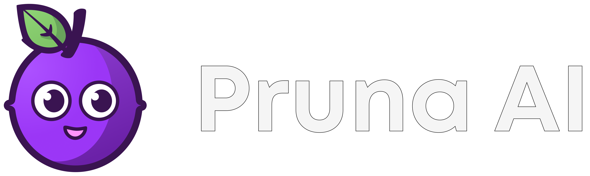
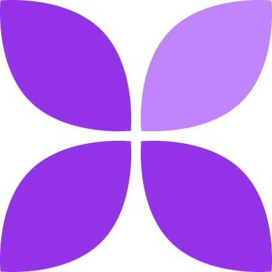
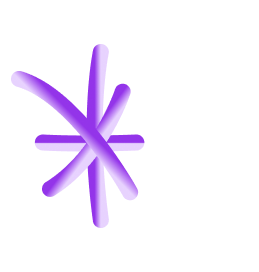
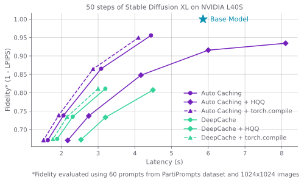
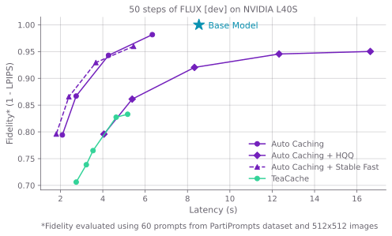
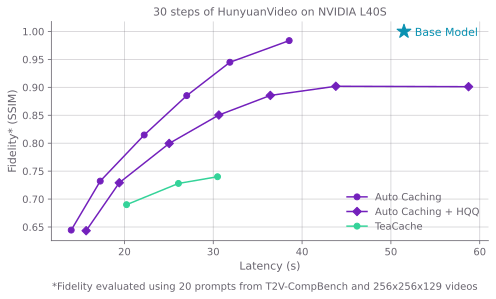

<div align="center">

</img>


  </img>
  **Simply make AI models faster, cheaper, smaller, greener!** 
  </img>

<br>

[][documentation]

<br>


[][website]
[][x]
[][devto]
[][reddit]
[][discord]
[][huggingface]
[][replicate]


<br>

</img>

</div>


## </img> Introduction

Pruna is a model optimization framework built for developers, enabling you to deliver faster, more efficient models with minimal overhead. It provides a comprehensive suite of compression algorithms including [caching](https://docs.pruna.ai/en/stable/compression.html#cachers), [quantization](https://docs.pruna.ai/en/stable/compression.html#quantizers), [pruning](https://docs.pruna.ai/en/stable/compression.html#pruners), [distillation](https://docs.pruna.ai/en/stable/compression.html#distillers) and [compilation](https://docs.pruna.ai/en/stable/compression.html#compilers) techniques to make your models:

- **Faster**: Accelerate inference times through advanced optimization techniques
- **Smaller**: Reduce model size while maintaining quality
- **Cheaper**: Lower computational costs and resource requirements
- **Greener**: Decrease energy consumption and environmental impact

The toolkit is designed with simplicity in mind - requiring just a few lines of code to optimize your models. It supports various model types including LLMs, Diffusion and Flow Matching Models, Vision Transformers, Speech Recognition Models and more.




**To move at top speed**, we offer [Pruna Pro](https://docs.pruna.ai/en/stable/docs_pruna_pro/user_manual/pruna_pro.html), our enterprise solution that unlocks advanced optimization features, our `OptimizationAgent`, priority support, and much more.
<br clear="left"/>


## </img> Installation

Pruna is currently available for installation on Linux, MacOS and Windows. However, some algorithms impose restrictions on the operating system and might not be available on all platforms.

Before installing, ensure you have:
- Python 3.9 or higher
- Optional: [CUDA toolkit](https://docs.nvidia.com/cuda/cuda-installation-guide-linux/) for GPU support

#### Option 1: Install Pruna using pip

Pruna is available on PyPI, so you can [install it using pip](https://docs.pruna.ai/en/stable/setup/pip.html):

```bash
pip install pruna
```

#### Option 2: Install Pruna from source

You can also install Pruna directly from source by cloning the repository and installing the package in editable mode:

```bash
git clone https://github.com/pruna-ai/pruna.git
cd pruna
pip install -e .
```

## </img> Quick Start

Before we start: Pruna allows to collect [a minimal set of aggregated, non-personal telemetry data](https://docs.pruna.ai/en/stable/user_manual/telemetry.html) to help us identify popular algorithms and improve the product. Telemetry is enabled by default because your participation helps us make Pruna better. However, if you'd prefer not to share this, you can always disable telemetry with:

```python
from pruna.telemetry import set_telemetry_metrics

set_telemetry_metrics(False)  # disable telemetry for current session
set_telemetry_metrics(False, set_as_default=True)  # disable telemetry globally
```


Getting started with Pruna is easy-peasy pruna-squeezy! 

First, load any pre-trained model. Here's an example using Stable Diffusion:

```python
from diffusers import StableDiffusionPipeline
base_model = StableDiffusionPipeline.from_pretrained("CompVis/stable-diffusion-v1-4")
```

Then, use Pruna's `smash` function to optimize your model. You can customize the optimization process using `SmashConfig`:

```python
from pruna import smash, SmashConfig

# Create and smash your model
smash_config = SmashConfig()
smash_config["cacher"] = "deepcache"
smashed_model = smash(model=base_model, smash_config=smash_config)
```

Your model is now optimized and you can use it as you would use the original model:

```python
smashed_model("An image of a cute prune.").images[0]
```

<br>

Pruna provides a variety of different compression and optimization algorithms, allowing you to combine different algorithms to get the best possible results:

```python
from pruna import smash, SmashConfig

# Create and smash your model
smash_config = SmashConfig()
smash_config["cacher"] = "deepcache"
smash_config["compiler"] = "stable_fast"
smashed_model = smash(model=base_model, smash_config=smash_config)
```

You can then use our evaluation interface to measure the performance of your model:

```python
from pruna.evaluation.task import Task
from pruna.evaluation.evaluation_agent import EvaluationAgent
from pruna.data.pruna_datamodule import PrunaDataModule

task = Task("image_generation_quality", datamodule=PrunaDataModule.from_string("LAION256")) 
eval_agent = EvaluationAgent(task) 
eval_agent.evaluate(smashed_model)
```


This was the minimal example, but you are looking for the maximal example? You can check out our [documentation][documentation] for an overview of all supported [algorithms][docs-algorithms] as well as our tutorials for more use-cases and examples.


## </img> Pruna Pro

Pruna has everything you need to get started on optimizing your own models. To push the efficiency of your models even further, we offer Pruna Pro. To give you a glimpse of what is possible with Pruna Pro, let us consider three of the most widely used diffusers pipelines and see how much smaller and faster we can make them. In addition to popular open-source algorithms, we use our proprietary Auto Caching algorithm. We compare the fidelity of the compressed models. Fidelity measures the similarity between the images of the compressed models and the images of the original model.

### Stable Diffusion XL

For [Stable Diffusion XL](https://huggingface.co/stabilityai/stable-diffusion-xl-base-1.0), we compare Auto Caching with [DeepCache](https://github.com/horseee/DeepCache) (available with Pruna). We combine these caching algorithms with torch.compile to get an additional **9%** reduction in inference latency, and we use [HQQ](https://github.com/mobiusml/hqq) 8-bit quantization to reduce the size of the model from **8.8GB** to **6.7GB**.



### FLUX [dev]
For [FLUX [dev]](https://huggingface.co/black-forest-labs/FLUX.1-dev), we compare Auto Caching with the popular [TeaCache](https://github.com/ali-vilab/TeaCache) algorithm. In this case, we used [Stable Fast](https://github.com/chengzeyi/stable-fast) to reduce the latency of Auto Caching by additional **13%**, and [HQQ](https://github.com/mobiusml/hqq) with 8-bit reduced the size of FLUX from **33GB** to **23GB**.



### HunyuanVideo
For [HunyuanVideo](https://huggingface.co/tencent/HunyuanVideo), we compare Auto Caching with [TeaCache](https://github.com/ali-vilab/TeaCache). Applying [HQQ](https://github.com/mobiusml/hqq) 8-bit quantization to the model reduced the size from **41GB** to **29GB**.




## </img> Algorithm Overview

Since Pruna offers a broad range of compression algorithms, the following table provides an overview of all methods available in Pruna and those exclusive to Pruna Pro. For a detailed description of each algorithm, have a look at our [documentation](https://docs.pruna.ai/en/stable/).

<table>
  <thead>
    <tr align="center">
      <th rowspan="2">Algorithm</th>
      <th rowspan="2"><div align="center">Pruna Pro</div></th>
      <th rowspan="2">Type</th>
      <th colspan="2" align="center"><div align="center">Hardware</div></th>
      <th colspan="4" align="center"><div align="center">Model Format</div></th>
    </tr>
    <tr>
      <th>CPU</th>
      <th>GPU</th>
      <th>🤗 Transformers CausalLM</th>
      <th>🤗 Diffusers Pipeline</th>
      <th>🤗 Transformers Whisper</th>
      <th>torch Module</th>
    </tr>
  </thead>
  <tbody>
    <!-- Quantizer group -->
    <tr>
      <td><strong>AWQ</strong></td>
      <td></td>
      <td>quantizer</td>
      <td></td>
      <td align="center"></td>
      <td align="center"></td>
      <td></td>
      <td></td>
      <td></td>
    </tr>
    <tr>
      <td><strong>GPTQ</strong></td>
      <td></td>
      <td>quantizer</td>
      <td></td>
      <td align="center"></td>
      <td align="center"></td>
      <td></td>
      <td></td>
      <td></td>
    </tr>
    <tr>
      <td><strong>HQQ</strong></td>
      <td></td>
      <td>quantizer</td>
      <td></td>
      <td align="center"></td>
      <td align="center"></td>
      <td align="center"></td>
      <td></td>
      <td></td>
    </tr>
    <tr>
      <td><strong>Int8</strong></td>
      <td></td>
      <td>quantizer</td>
      <td></td>
      <td align="center"></td>
      <td align="center"></td>
      <td align="center"></td>
      <td></td>
      <td></td>
    </tr>
    <tr>
      <td><strong>QUANTO</strong></td>
      <td></td>
      <td>quantizer</td>
      <td></td>
      <td align="center"></td>
      <td align="center"></td>
      <td align="center"></td>
      <td></td>
      <td align="center"></td>
    </tr>
    <tr>
      <td><strong>Torch Dynamic</strong></td>
      <td></td>
      <td>quantizer</td>
      <td align="center"></td>
      <td align="center"></td>
      <td align="center"></td>
      <td></td>
      <td></td>
      <td align="center"></td>
    </tr>
    <tr>
      <td><strong>HIGGS</strong></td>
      <td align="center"></td>
      <td>quantizer</td>
      <td></td>
      <td align="center"></td>
      <td align="center"></td>
      <td></td>
      <td></td>
      <td></td>
    </tr>
    <tr>
      <td><strong>torchao</strong></td>
      <td align="center"></td>
      <td>quantizer</td>
      <td align="center"></td>
      <td align="center"></td>
      <td align="center"></td>
      <td align="center"></td>
      <td align="center"></td>
      <td align="center"></td>
    </tr>
    <tr>
      <td><strong>PERP</strong></td>
      <td align="center"></td>
      <td>recoverer</td>
      <td align="center"></td>
      <td align="center"></td>
      <td align="center"></td>
      <td align="center"></td>
      <td></td>
      <td></td>
    </tr>
    <tr>
      <td><strong>c_translate</strong></td>
      <td></td>
      <td>compiler</td>
      <td></td>
      <td align="center"></td>
      <td></td>
      <td></td>
      <td align="center"></td>
      <td></td>
    </tr>
    <tr>
      <td><strong>IPEX</strong></td>
      <td align="center"></td>
      <td>compiler</td>
      <td align="center"></td>
      <td></td>
      <td align="center"></td>
      <td></td>
      <td></td>
      <td></td>
    </tr>
    <tr>
      <td><strong>OneDiff <sup><a href="#footnote1" id="ref1">1</a></sup></strong></td>
      <td></td>
      <td>compiler</td>
      <td></td>
      <td align="center"></td>
      <td></td>
      <td align="center"></td>
      <td></td>
      <td></td>
    </tr>
    <tr>
      <td><strong>Stable Fast</strong></td>
      <td></td>
      <td>compiler</td>
      <td></td>
      <td align="center"></td>
      <td></td>
      <td align="center"></td>
      <td></td>
      <td></td>
    </tr>
    <tr>
      <td><strong>torch.compile</strong></td>
      <td></td>
      <td>compiler</td>
      <td align="center"></td>
      <td align="center"></td>
      <td align="center"></td>
      <td align="center"></td>
      <td align="center"></td>
      <td align="center"></td>
    </tr>
    <tr>
      <td><strong>x-fast</strong></td>
      <td align="center"></td>
      <td>compiler</td>
      <td></td>
      <td align="center"></td>
      <td align="center"></td>
      <td align="center"></td>
      <td align="center"></td>
      <td align="center"></td>
    </tr>
    <tr>
      <td><strong>DeepCache<sup><a href="#footnote2" id="ref2">2</a></sup></strong></td>
      <td></td>
      <td>cacher</td>
      <td align="center"></td>
      <td align="center"></td>
      <td></td>
      <td align="center"></td>
      <td></td>
      <td></td>
    </tr>
    <tr>
      <td><strong>Adaptive Caching</strong></td>
      <td align="center"></td>
      <td>cacher</td>
      <td align="center"></td>
      <td align="center"></td>
      <td></td>
      <td align="center"></td>
      <td></td>
      <td></td>
    </tr>
    <tr>
      <td><strong>Auto Caching</strong></td>
      <td align="center"></td>
      <td>cacher</td>
      <td align="center"></td>
      <td align="center"></td>
      <td></td>
      <td align="center"></td>
      <td></td>
      <td></td>
    </tr>
    <tr>
      <td><strong>FLUX Caching<sup><a href="#footnote3" id="ref3">3</a></sup></strong></td>
      <td align="center"></td>
      <td>cacher</td>
      <td align="center"></td>
      <td align="center"></td>
      <td></td>
      <td align="center"></td>
      <td></td>
      <td></td>
    </tr>
    <tr>
      <td><strong>Periodic Caching</strong></td>
      <td align="center"></td>
      <td>cacher</td>
      <td align="center"></td>
      <td align="center"></td>
      <td align="center"></td>
      <td></td>
      <td align="center"></td>
      <td></td>
      <td></td>
    </tr>
    <tr>
      <td><strong>HYPER<sup><a href="#footnote4" id="ref4">4</a></sup></strong></td>
      <td align="center"></td>
      <td>distiller</td>
      <td align="center"></td>
      <td align="center"></td>
      <td align="center"></td>
      <td></td>
      <td align="center"></td>
      <td></td>
      <td></td>
    </tr>
    <tr>
      <td><strong>Structured Pruning</strong></td>
      <td></td>
      <td>pruner</td>
      <td align="center"></td>
      <td align="center"></td>
      <td></td>
      <td></td>
      <td></td>
      <td align="center"></td>
    </tr>
    <tr>
      <td><strong>Unstructured Pruning</strong></td>
      <td></td>
      <td>pruner</td>
      <td align="center"></td>
      <td align="center"></td>
      <td align="center"></td>
      <td></td>
      <td></td>
      <td align="center"></td>
    </tr>
    <tr>
      <td><strong>ifw</strong></td>
      <td></td>
      <td>batcher</td>
      <td></td>
      <td align="center"></td>
      <td></td>
      <td></td>
      <td align="center"></td>
      <td></td>
    </tr>
    <tr>
      <td><strong>ws2t</strong></td>
      <td></td>
      <td>batcher</td>
      <td></td>
      <td align="center"></td>
      <td></td>
      <td></td>
      <td align="center"></td>
      <td></td>
    </tr>
  </tbody>
</table>

<span id="footnote1">1. Only available for transformer-based diffusers pipelines.</span><br>
<span id="footnote2">2. Only available for unet-based diffusers pipelines.</span><br>
<span id="footnote3">3. Only available for FLUX models.</span><br>
<span id="footnote4">4. Only available for FLUX, SD-XL, SD-v1-4, SD-v1-5, SD-3.5.</span>

<br><br>

<p align="center"></img></p>

<br>

## </img> FAQ and Troubleshooting

If you can not find an answer to your question or problem in our [documentation][documentation], in our [FAQs][docs-faq] or in an existing issue, we are happy to help you! You can either get help from the Pruna community on [Discord][discord], join our [Office Hours][docs-office-hours] or open an issue on GitHub.

## </img> Contributors


The Pruna package was made with 💜 by the Pruna AI team. [Contribute to the repository][docs-contributing] to become part of the Pruna family!

<a href="https://github.com/PrunaAI/pruna/graphs/contributors">
  
</a>

Contributors are displayed in a random order to avoid any perceived ranking.

## </img> Citation

If you use Pruna in your research, feel free to cite the project! 💜

```
    @misc{pruna,
    title = {Efficient Machine Learning with Pruna},
    year = {2023},
    note = {Software available from pruna.ai},
    url={https://www.pruna.ai/}
    }
```

<br>

<p align="center"></img></p>


[discord]: https://discord.gg/Tun8YgzxZ9
[reddit]: https://www.reddit.com/r/PrunaAI/
[x]: https://x.com/PrunaAI
[devto]: https://dev.to/pruna-ai
[website]: https://pruna.ai
[huggingface]: https://huggingface.co/PrunaAI
[replicate]: https://replicate.com/prunaai
[documentation]: https://docs.pruna.ai/en/stable
[docs-algorithms]: https://docs.pruna.ai/en/stable/user_manual/compression.html
[docs-faq]: https://docs.pruna.ai/en/stable/resources/faq.html
[docs-office-hours]: https://docs.pruna.ai/en/stable/resources/office_hours.html
[docs-contributing]: https://docs.pruna.ai/en/stable/contributions/how_to_contribute.html